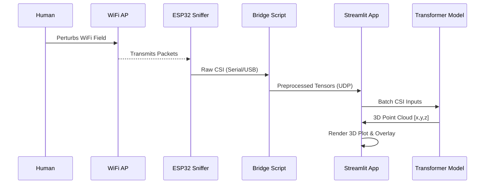
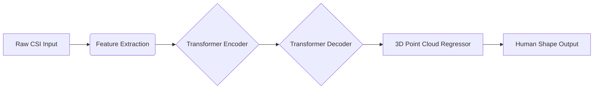
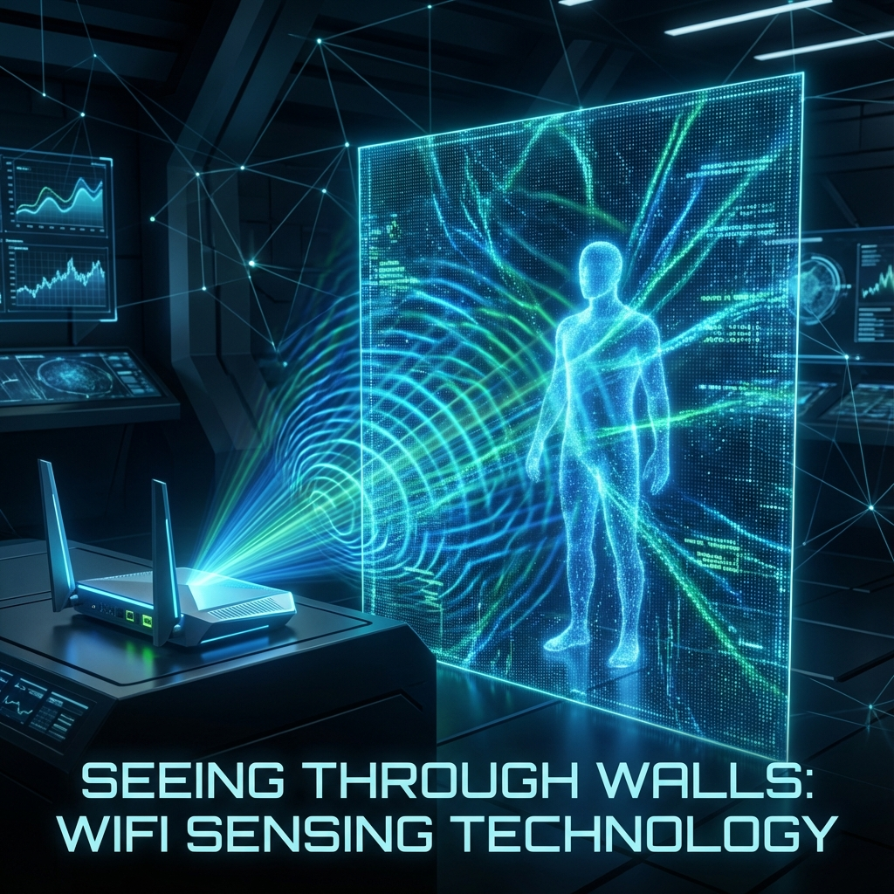

# 📡 WiFi-CSI Through-Wall Sensing System

**A Privacy-Preserving Human Detection & Pose Estimation System using WiFi Signals.**

---

## 📖 Table of Contents
- [Project Overview](#-project-overview)
- [Why WiFi Sensing?](#-why-wifi-sensing)
- [System Architecture](#-system-architecture)
- [How It Works](#-how-it-works)
- [Project Status & Roadmap](#-project-status--roadmap)
- [Installation & Setup](#-installation--setup)
- [Usage](#-usage)

---

## 🔭 Project Overview

**WiFi2CSI** is an advanced research prototype designed to visualize and track human presence through walls using standard WiFi signals. By leveraging **Channel State Information (CSI)**, the system reconstructs 3D point clouds of human subjects without the need for cameras or wearable sensors.

This project implements concepts from SOTA research in RF-sensing, utilizing a Transformer-based neural network to map 1D WiFi subcarrier data into 3D spatial coordinates.

### Key Features
- **Privacy-First**: No video feeds are recorded or analyzed. Only RF signals are used.
- **Through-Wall Capability**: WiFi signals penetrate obstacles, allowing detection in occluded spaces.
- **Real-Time Visualization**: Interactive 3D point cloud rendering via Streamlit & Plotly.
- **Hardware Agnostic Bridge**: Decoupled hardware interface supports ESP32 CSI Toolkits.
- **Webcam Fusion**: Optional overlay of "WiFi vision" onto a standard camera feed for ground-truth comparison.

---

## ❓ Why WiFi Sensing?

Traditional monitoring solutions rely on RGB cameras (privacy invasive) or LIDAR (expensive). WiFi sensing offers a unique sweet spot:
1.  **Ubiquitous**: Uses existing WiFi infrastructure.
2.  **Privacy**: Can detect *people* but not *identities* (faces).
3.  **Robust**: Works in total darkness and through smoke or walls.

---

## 🏗 System Architecture

The project consists of three main modules:
1.  **Hardware Layer**: ESP32 microcontroller capturing CSI packets.
2.  **Bridge Layer**: Python script (`hardware_bridge.py`) converting Serial data to UDP data streams.
3.  **Application Layer**: Streamlit dashboard (`app.py`) running the Neural Network and Visualization.

### 🔄 Data Flow Diagram

---

## 🧠 How It Works

### The Neural Network
The core logic resides in `model.py` (referenced). It uses an Encoder-Decoder Transformer architecture.

1.  **Input**: Complex CSI data (Amplitude & Phase) across multiple subcarriers and antennas.
2.  **Processing**: The model learns spatial correlations in the phase shifts caused by signal reflections off the human body.
3.  **Output**: A set of $(x, y, z)$ coordinates representing the body's surface.

---

## 🚧 Project Status & Roadmap

The project is currently in the **Alpha / Prototype** phase. Below is a detailed breakdown of the development stages:

| Component | Stage | Phase | Status | details |
| :--- | :--- | :--- | :--- | :--- |
| **Core Architecture** | **Alpha** | `Infrastructure` | ✅ Complete | Basic project structure, file modulation, and app skeleton are built. |
| **Synthetic Pipeline** | **Beta** | `Simulation` | ✅ Live | "breathing" human simulation and synthetic CSI data generation are active for demos. |
| **Hardware Bridge** | **Alpha** | `Hardware` | ⚠️ Testing | Serial communication logic is written; requires physical ESP32 device calibration. |
| **Neural Network** | **Pre-Alpha** | `Deep Learning` | 🚧 In Progress | Transformer architecture is defined in code (`model.py`), but weights are untrained. |
| **Visualization UI** | **Beta** | `Frontend` | ✅ Stable | Real-time 3D Plotly rendering and Webcam overlay are fully functional. |
| **Real-Time Data** | **Planner** | `Integration` | 🛑 Pending | End-to-end pipeline from hardware to model inference is not yet verified with real signals. |

> **Current Focus**: Moving from *Synthetic Data* to *Real-World CSI Data* collection to train the model.

---

## 📸 Gallery

*Conceptual visualization: The system interprets reflected RF signals (WiFi) to reconstruct a spatial understanding of the environment, effectively "seeing" human presence through obstacles.*

---

**Developed with ❤️ by Santhosh Nadella**
