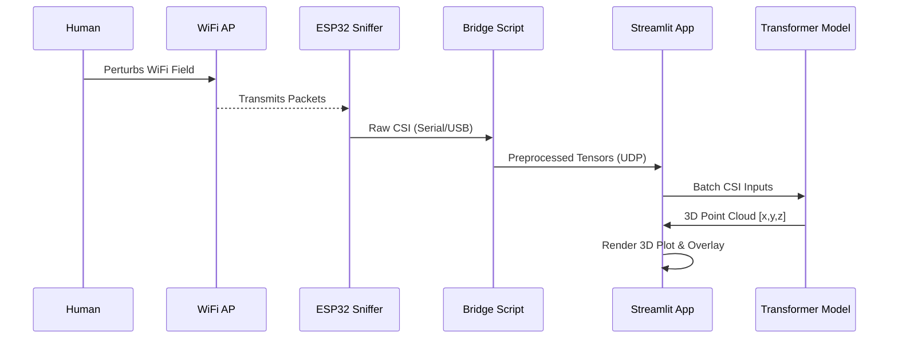
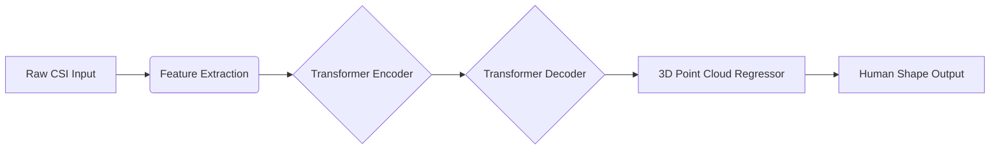

# 📡 WiFi-CSI Through-Wall Sensing System

[](https://www.python.org/downloads/)
[](https://pytorch.org/)
[](https://streamlit.io/)
[](https://opensource.org/licenses/MIT)

**A Privacy-Preserving Human Detection & Pose Estimation System using WiFi Signals.**

---

## 📖 Table of Contents
- [Project Overview](#-project-overview)
- [Why WiFi Sensing?](#-why-wifi-sensing)
- [System Architecture](#-system-architecture)
- [How It Works](#-how-it-works)
- [Project Status & Roadmap](#-project-status--roadmap)
- [Installation & Setup](#-installation--setup)
- [Usage](#-usage)

---

## 🔭 Project Overview

**WiFi2CSI** is an advanced research prototype designed to visualize and track human presence through walls using standard WiFi signals. By leveraging **Channel State Information (CSI)**, the system reconstructs 3D point clouds of human subjects without the need for cameras or wearable sensors.

This project implements concepts from SOTA research in RF-sensing, utilizing a Transformer-based neural network to map 1D WiFi subcarrier data into 3D spatial coordinates.

### Key Features
- **Privacy-First**: No video feeds are recorded or analyzed. Only RF signals are used.
- **Through-Wall Capability**: WiFi signals penetrate obstacles, allowing detection in occluded spaces.
- **Real-Time Visualization**: Interactive 3D point cloud rendering via Streamlit & Plotly.
- **Hardware Agnostic Bridge**: Decoupled hardware interface supports ESP32 CSI Toolkits.
- **Webcam Fusion**: Optional overlay of "WiFi vision" onto a standard camera feed for ground-truth comparison.

---

## ❓ Why WiFi Sensing?

Traditional monitoring solutions rely on RGB cameras (privacy invasive) or LIDAR (expensive). WiFi sensing offers a unique sweet spot:
1.  **Ubiquitous**: Uses existing WiFi infrastructure.
2.  **Privacy**: Can detect *people* but not *identities* (faces).
3.  **Robust**: Works in total darkness and through smoke or walls.

---

## 🏗 System Architecture

The project consists of three main modules:
1.  **Hardware Layer**: ESP32 microcontroller capturing CSI packets.
2.  **Bridge Layer**: Python script (`hardware_bridge.py`) converting Serial data to UDP data streams.
3.  **Application Layer**: Streamlit dashboard (`app.py`) running the Neural Network and Visualization.

### 🔄 Data Flow Diagram


---

## 🧠 How It Works

### The Neural Network
The core logic resides in `model.py` (referenced). It uses an Encoder-Decoder Transformer architecture.



1.  **Input**: Complex CSI data (Amplitude & Phase) across multiple subcarriers and antennas.
2.  **Processing**: The model learns spatial correlations in the phase shifts caused by signal reflections off the human body.
3.  **Output**: A set of $(x, y, z)$ coordinates representing the body's surface.

---

## 🚧 Project Status & Roadmap

**Current Phase:** `Alpha / Prototype`

| Feature | Status | Notes |
|TBD|---|---|
| **Synthetic Data Pipeline** | ✅ Live | Generates fake CSI for instant demos. |
| **Hardware Bridge** | ⚠️ Beta | Serial-to-UDP implemented; requires generic ESP32 firmware. |
| **Model Inference** | 🚧 WIP | Model architecture defined; Pre-trained weights pending integration. |
| **Visualization** | ✅ Live | 3D Plotly & Webcam Overlay working efficiently. |

**Note**: The current version runs in a **"Demo Mode"** by default. It simulates CSI data and produces a procedural "breathing" human shape to demonstrate the visualization pipeline without requiring physical hardware setup.

---

## 💻 Installation & Setup

### Prerequisites
- Python 3.8+
- [Optional] CUDA-capable GPU for faster inference.

### 1. Clone the Repository
```bash
git clone https://github.com/Santhoshnadella/wifi2csi.git
cd wifi2csi
```

### 2. Install Dependencies
```bash
pip install -r requirements.txt
```

### 3. Run the Application
```bash
streamlit run app.py
```

---

## 🕹 Usage

### Dashboard Controls
- **Sidebar**: Toggle between "Live Demo (Synthetic)" and "Hardware Mode".
- **Augmented Vision**: See the WiFi-detected points overlaid on your webcam (if enabled).
- **3D Reconstruction**: Interact with the rotatable 3D point cloud of the detected person.

### Connecting Hardware
To use real data:
1.  Flash your ESP32 with [ESP32-CSI-Tool](https://github.com/espressif/esp-csi).
2.  Connect ESP32 via USB.
3.  Update `COM_PORT` in `hardware_bridge.py`.
4.  Run the bridge:
    ```bash
    python hardware_bridge.py
    ```
5.  Select "Live CSI Stream" in the Streamlit app.

---

## 📸 Gallery
*(Placeholder for future screenshots)*
- **Left**: Real-world camera view.
- **Right**: Neural Network reconstructed point cloud seeing through the wall.

---

**Developed with ❤️ by Santhosh Nadella**
